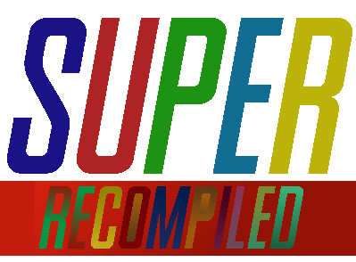

[](https://github.com/ExpansionPak/SuperRecomp)

# SuperRecomp
A tool to statically recompile [SNES](https://en.wikipedia.org/wiki/Super_Nintendo_Entertainment_System) games into native executables. It works by reading the raw bytes of a ROM and then generate [C++](https://en.wikipedia.org/wiki/C%2B%2B) code of the game. The project is in a very early stage. So while C++ code generation is okay as of now. It still needs a few more polishing to be compiled without any errors.

Demonstration of the tool itself using a clean dump of [Super Mario World](https://en.wikipedia.org/wiki/Super_Mario_World) without a 512-byte header.

https://github.com/user-attachments/assets/bc8e781c-8fc8-4a88-9fce-41251fe4a63e

# WAIT! But is this really necessary?

SNES emulation is already accurate enough that technically a Static Recompiler isn't really "needed". The reason most game consoles like the [N64](https://en.wikipedia.org/wiki/Nintendo_64) have a Static Recompiler is because N64 emulation is still a mess in 2026. And most recompiled N64 games offer enhancements like Mods, Ray Tracing and 120 FPS support. However. There are some benefits of a Statically Recompiled SNES game.

- # Native performance
Static recompilation converts SNES machine code into native C or machine code ahead of time. For most game consoles like the N64 or PS2. This can matter alot. But for the SNES. it’s like putting a jet engine on a bicycle. So it's kind of pointless here.

- # Portability (the actually interesting part)
Recompiled games can run as standalone apps (no emulator needed) and be ported to weird platforms (mobile, web, consoles). Basically: turning ROMs into programs, not just data for an emulator

- # Modding & reverse engineering
A static recompiler allows you to modify a game in C++ instead of [Assembly](https://en.wikipedia.org/wiki/Assembly_language). Which makes the process of making mods for the game much easier. The bad news is a Static Recompiler does not generate readable human code. You have function names like `sub_0xXXXX` address names like `addr_0xXXXX`. The good news is that [we](https://github.com/ExpansionPak) are been planning to release a Table that documents these recompiled functions and lists a possible function name for the specific function in each game. Like `UpdateMarioPhysics()` or `HandleMarioPhysics()`.

# Instructions
First. Download [MSYS2](https://www.msys2.org/) and [CMake](https://cmake.org/download/). [Ninja](https://github.com/ninja-build/ninja/releases) is also heavily recommended.

Open the UCRT64 terminal and enter
```
git clone https://github.com/ExpansionPak/SuperRecomp.git
```
Now. Inside your cloned repo. Enter
```
mkdir build && cd build
cmake ..
cmake --build . --target RecompTool
```
Or. If you have Ninja. Enter `ninja RecompTool` instead pf `cmake --build . --target RecompTool`

# Usage
```
./RecompTool <path/to/rom>
```

# A TOOL MADE BY:
[](https://github.com/ExpansionPak)
